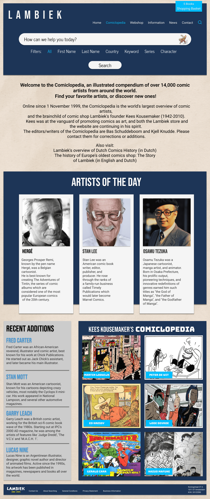
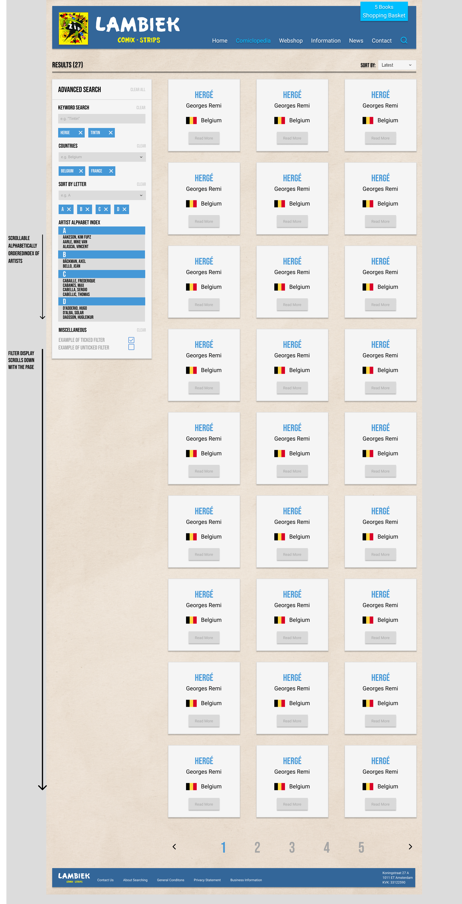
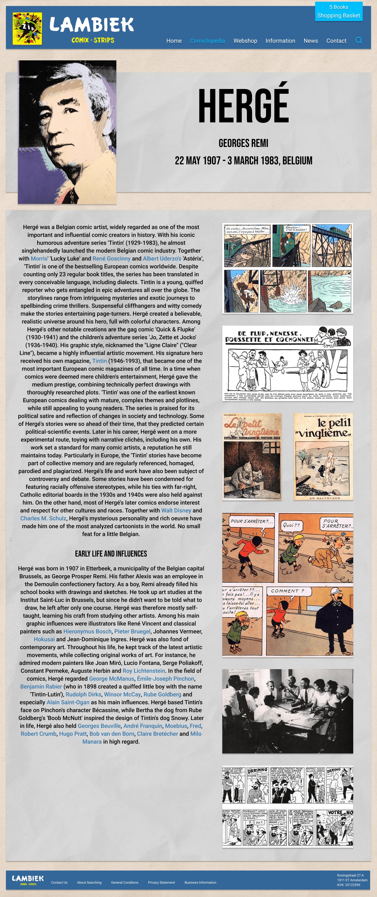

# Project Lambiek

### Welcome to the Lambiek Project! 

Our mission was to create a new and improved version of the Comiclopedia from Lambiek, focusing on modernisation and innovative features. We embarked on a journey to revitalise the platform by implementing a redesigned website and an optimised the search functionality. With over 10,000 articles to browse through, we aimed to provide users with a seamless and engaging experience. By harnessing the latest advancements in web development, we strived to enrirhc and enhance the exploration of the fascinating world of comics.

## Project overview:

Project Lambiek is a web-based application that leverages modern technologies to enhance the user experience of the existing Comiclopedia platform from Lambiek. The project utilises a stack consisting of PHP, Apache (HTTP server), MariaDB (or similar MySQL server), NodeJS, npm, Tailwind CSS, and tw-elements.

Key Dependencies:

- PHP 8 or greater: The project is built using PHP, a server-side scripting language known for its versatility and performance.

- Apache HTTP server: Apache is used as the web server to handle HTTP requests and serve the application to users.

- MariaDB or similar MySQL server: The project relies on a database management system to store and retrieve data efficiently. MariaDB or a similar MySQL server is used for this purpose.

- NodeJS and npm: NodeJS is a JavaScript runtime that enables running JavaScript on the server-side. npm (Node Package Manager) is used for managing project dependencies and package installations.

- Tailwind CSS: Tailwind CSS is a utility-first CSS framework that offers a flexible and customizable approach to styling web applications. It is utilized to create a modern and visually appealing user interface.

- tw-elements: tw-elements is a library that provides pre-built UI components compatible with Tailwind CSS. It allows for faster development and consistent styling of the application's UI components.

The project integrates these technologies to create a revamped version of Comiclopedia. The PHP backend handles data retrieval and processing, while Apache serves the application to users. The MariaDB or MySQL server stores the necessary data for the application. NodeJS and npm manage project dependencies and allow for efficient package installations. Tailwind CSS and tw-elements ensure a modern and visually appealing user interface.

The utilisation of these technologies, the project aimed to provide an improved and immersive experience for users exploring the vast world of comics on the Comiclopedia platform.

## Installation and Testing Guide

Please follow the instructions below to install and test the Lambiek Project:

**Note:**
Before proceeding with the installation, please ensure that you have the necessary SQL data for testing purposes. If the test data SQL import is not yet available, the project may not be fully reproducible.

1. **Check SQL User Privileges and PDO Connection:**
   Ensure that you have the required SQL user privileges and that the PDO connection to your database is properly configured.

2. **Install Node.js and npm:**
   Ensure that Node.js and npm are installed on your system. You can download and install the latest stable versions from the official Node.js website: [https://nodejs.org](https://nodejs.org).

3. **Install Project Dependencies:**
   From the root directory of the project, run the following command to install the necessary dependencies: ``` npm install ```

4. **Compile CSS:**
To compile the CSS files, you have two options:
- Run the `npm run tails` script, which will compile the CSS using the configured Tailwind CSS setup.
- Manually compile the CSS if you prefer a custom compilation process.

5. **Host the Project:**
Host the project from your server's document root or a suitable hosting environment. Ensure that your server is properly configured to serve PHP files.

6. **Access the Project:**
Navigate to the hosted project in your web browser. You should be able to access the Lambiek Project and start testing its features.

**Important:**
Please be aware that without the suitable test data SQL import, some features and functionalities may not work as expected during testing.

### Wireframes

Here are a few wireframes of our updated site:

Homepage:



Search:



Article:


## Notice
Please note that the Lambiek Project is not affiliated with the original website of Lambiek. You can access the original website [here](https://lambiek.net "lambiek.net"), and all rights belong to their respective owners.

As part of our project, we have created a replacement website for lambiek.net called the new Comiclopedia. We invite you to explore the results of our work and experience the enhancements we have implemented. For a limited duration, you can access the new Comiclopedia website [here](https://new.lambiek.net "new.lambiek.net").

Please keep in mind that the new Comiclopedia is a demonstration of our efforts to revitalise and improve the user experience of the original Comiclopedia. It does not include the complete content or functionality of the original website.

### Compatibility

The Lambiek Project is designed to be compatible with the following software versions:

- PHP 8 or greater
- Apache HTTP server
- MariaDB or similar MySQL server
- Node.js 18.3.0 or greater
- npm 8.7.0 or greater

Please ensure that your system meets these requirements for optimal performance and compatibility.

### Credits

The Lambiek Project is the result of the collaborative effort of the following individuals from the Bit Academy:

Brian Langley
[Linkedin](https://www.linkedin.com/in/bel97/)
[Github](https://github.com/brianlangley)

Erhan Citil
[Linkedin](https://www.linkedin.com/in/erhancitil/)
[Github](https://github.com/ErhanCitil)

Batuhan Yumak
[Linkedin](https://www.linkedin.com/in/batuhanyumak/)
[Github](https://github.com/BatuhanYumak)

Raymon Roos
[Linkedin](https://www.linkedin.com/in/raymon-roos-1840a7228/)
[Github](https://github.com/raymon-roos)


We would also like to express our gratitude to the open-source community for providing valuable resources, libraries, and frameworks that contributed to the development of this project.

### License

The Lambiek Project is licensed under the MIT License. You are free to use, modify, and distribute this project in accordance with the terms and conditions of the license.

Please refer to the [LICENSE](LICENSE) file for more information about the rights and restrictions associated with the use of this project.
